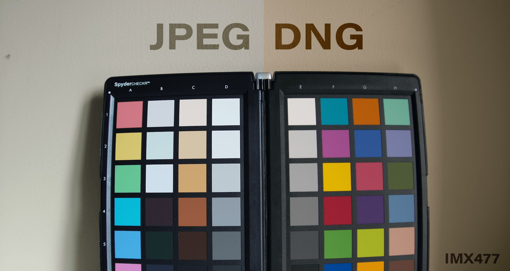
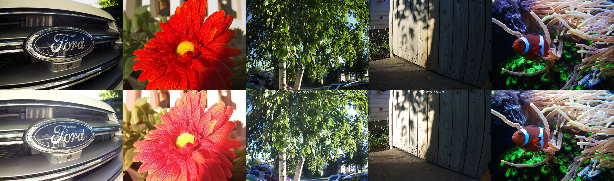

PiDNG
=========


Create Adobe DNG RAW files using Python.

<!--  -->

**Features**
------------

- 8,10,12,14,16-bit precision
- Lossless compression
- DNG Tags ( extensible )

### Works with any **Bayer RAW** Data including native support for **Raspberry Pi cameras**.
- OV5467 ( Raspberry Pi Camera Module V1 )
- IMX219 ( Raspberry Pi Camera Module V2 )
- IMX477( Raspberry Pi High Quality Camera )

<!-- *Raspberry Pi High Quality Camera examples below ( DNG top, JPEG bottom )* -->

<!--  -->

***

Instructions
------------

Requires: 
- Python3 
- Numpy  

### Install

From PyPI:
```
python3 -mpip install PiDNG 
```

Latest version from GitHub:

```
python3 -mpip install  git+https://github.com/schoolpost/PiDNG.git
```

***

Credits
------------
Source referenced from:

CanPi ( Jack ) | [color-matrices](https://www.raspberrypi.org/forums/viewtopic.php?f=43&t=278828)

Waveform80 | [picamera](https://github.com/waveform80/picamera)

Krontech | [chronos-utils](https://github.com/krontech/chronos-utils)

Andrew Baldwin | [MLVRawViewer](https://bitbucket.org/baldand/mlrawviewer)


